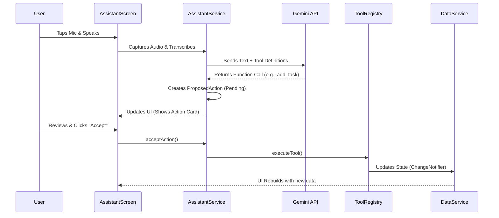

# Voice AI Assistant Integration Plan

This plan implements a voice-controlled assistant that acts as a specialized "Project" in the first column. When selected, it replaces the task and subtask columns with a Chat and Verification interface.

## Architecture & Data Flow

## Implementation Steps

### 1. Dependencies & Configuration

Add required packages to [`knowledge_base/design_specs_2025_12_13/flutter_app/pubspec.yaml`](knowledge_base/design_specs_2025_12_13/flutter_app/pubspec.yaml):

- `google_generative_ai`: For Gemini API access.
- `speech_to_text`: For microphone input.
- `permission_handler`: For iOS/Android permission management.
- `flutter_markdown`: For rendering rich text responses from AI.

### 2. Data Models

Create [`knowledge_base/design_specs_2025_12_13/flutter_app/lib/models/ai_models.dart`](knowledge_base/design_specs_2025_12_13/flutter_app/lib/models/ai_models.dart):

- `ProposedAction`: Stores `toolName`, `toolArgs`, `description`, and unique ID.
- `ChatMessage`: Stores `text`, `isUser`, `timestamp` for the chat interface.

### 3. Service Layer Enhancements

**Update Tool Registry**

Modify [`knowledge_base/design_specs_2025_12_13/flutter_app/lib/ai_tools/tool_registry.dart`](knowledge_base/design_specs_2025_12_13/flutter_app/lib/ai_tools/tool_registry.dart):

- Add `describeAction(name, args)`: Returns a human-readable string (e.g., "Create project 'Marketing'") for the UI to display before execution.

**Create Assistant Service**

Create [`knowledge_base/design_specs_2025_12_13/flutter_app/lib/services/assistant_service.dart`](knowledge_base/design_specs_2025_12_13/flutter_app/lib/services/assistant_service.dart):

- Manages `SpeechToText` session.
- Manages `GenerativeModel` (Gemini) chat session.
- Maintains `List<ProposedAction> pendingActions`.
- Handles `acceptAction()` (calls Registry) and `declineAction()` (removes from list).

### 4. UI Implementation

**Assistant Screen**

Create [`knowledge_base/design_specs_2025_12_13/flutter_app/lib/ui/assistant_screen.dart`](knowledge_base/design_specs_2025_12_13/flutter_app/lib/ui/assistant_screen.dart):

- **Layout**: Two columns (taking up the space of Columns 2 & 3).
    - **Left (Chat)**: Message history + Microphone button input.
    - **Right (Review)**: List of `ProposedAction` cards.
- **Interactions**:
    - Mic button toggles listening state.
    - "Accept" button triggers execution.
    - "Decline" button dismisses proposal.

**App Integration**

Modify [`knowledge_base/design_specs_2025_12_13/flutter_app/lib/app.dart`](knowledge_base/design_specs_2025_12_13/flutter_app/lib/app.dart):

- **Project List**: Inject a static "✨ AI Assistant" item at index 0 of the Projects column.
- **Navigation Logic**:
    - If "AI Assistant" is selected: Render `AssistantScreen` in the remaining space.
    - Else: Render standard `Tasks` and `Subtasks` columns.

### 5. Permissions

- Update `ios/Runner/Info.plist` (Microphone usage description).
- Update `android/app/src/main/AndroidManifest.xml` (Record Audio permission).

## Verification Plan

1.  **Manual Test**: Tap "AI Assistant", grant permissions.
2.  **Voice Test**: Speak "Create a project called 'Demo'".
3.  **UI Check**: Verify chat updates with transcript. Verify "Proposed Changes" column shows a card "Create project 'Demo'".
4.  **Execution Test**: Click "Accept". Verify the new project appears in the Projects column on the left.
5. Automated Test: To avoid feature loss add complete automated test