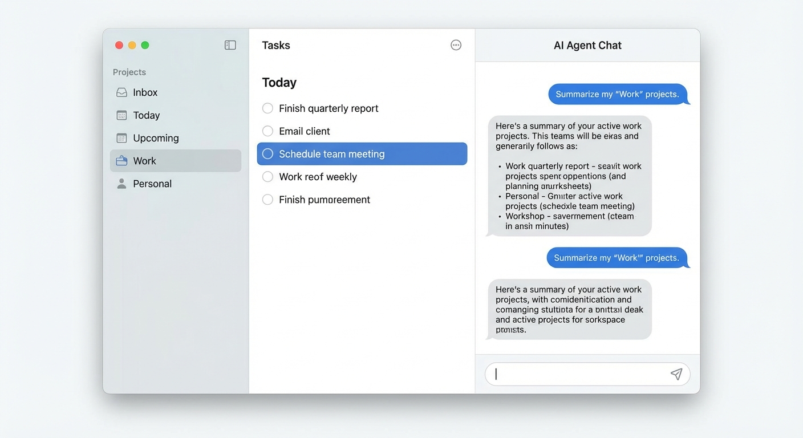
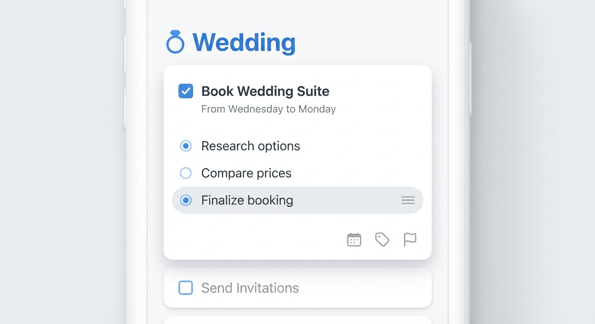

# Design Specification: AssistedIntelligence (v1.0)

**Date**: 2025-12-13
**Status**: Approved
**Aesthetic Goal**: "Professional Productivity" (Inspired by *Things 3*)

## 1. Core Layout Structure
The application uses a **3-Column Split View** to integrate Project Management with AI Assistance seamlessly.

### Column 1: Navigation (Sidebar)
- **Role**: Context Switching.
- **Visuals**: Translucent, subtle light gray background (`#F5F5F7` or similar).
- **Content**:
    - **Inbox / Today / Upcoming** (Top section, colorful icons).
    - **Projects List** (Bottom section, clean typography).
- **Typography**: San Francisco, Regular weight.

### Column 2: The Task List (Canvas)
- **Role**: The main workspace.
- **Visuals**: Pure white background (`#FFFFFF`). Paper-like feel. No heavy borders.
- **Interaction**:
    - **List Items**: Clean text rows with generous whitespace (12-16px padding).
    - **Selection**: "Pill" shape highlight (Blue `#007AFF` or Light Gray in expanded state).

### Column 3: The Agent (Assistant)
- **Role**: AI-powered execution and context.
- **Visuals**: Continues the clean, borderless aesthetic of Column 2.
- **Behavior**:
    - **Context Aware**: The agent knows the context of the selected task in Column 2.
    - **Chat Interface**: Minimalist message bubbles (User = Blue, AI = Gray).
    - **Session Management**: Ability to "Reset" or "Archive" a chat session to start fresh on a new task.

---

## 2. Component Detail: The Expanded Task Card
When a user selects a task to work on, it expands into a detailed card, replacing the simple row.

### Visual Design
- **Container**: White card with rounded corners (8-12px radius) and a soft, diffuse shadow.
- **Background**: When expanded, the list background acts as a surface for the card to float on.

### Content Hierarchy
1.  **Header**:
    -   **Checkbox**: Square, standard.
    -   **Title**: Large, Bold text.
    -   **Notes**: Subtle gray text below title (for deadlines or brief context).
2.  **Body (The "Agent Summary")**:
    -   A text block summarizing the current status or the result of the Agent's work.
3.  **Subtasks (Checklist)**:
    -   Linear list of subtasks.
    -   **Active State**: The subtask currently being worked on is highlighted with a **Light Gray Pill** background.
    -   **Actions**: "Hamburger" menu or action icons appear on the active row.
4.  **Footer**:
    -   Minimal icon toolbar aligned right (Calendar, Tags, Flag).

---

## 3. Design Principles
-   **Invisible Design**: Eliminate unnecessary borders, lines, and "container" boxes. Use whitespace to separate elements.
-   **Typography First**: Use font weight (Bold vs. Regular) and color (Black vs. Gray) to establish hierarchy, not background colors.
-   **Paper Metaphor**: The interface should feel like interacting with a clean sheet of paper or a set of cards, not a database grid.

